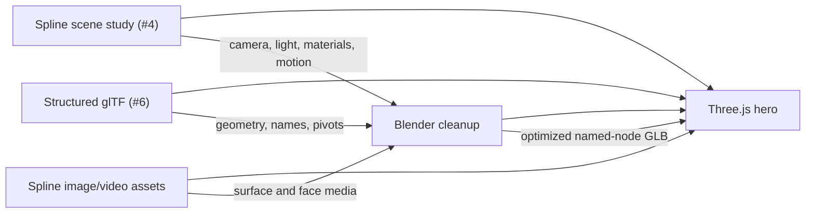

# Nextbot hero scene study report

This report is the entry point for a new engineer or LLM joining the Nextbot
hero migration. The goal is to reproduce the existing Spline hero in a lighter
Three.js implementation without losing its composition, materials, or motion.

## Executive status

- The Spline scene has been inspected: hierarchy, transforms, primitives,
  camera, point light, layered materials, logo, video, and interactions are
  recorded.
- The original 23-OBJ export is unsuitable: it repeats one flattened,
  untextured robot 23 times for 222.338 MiB.
- The new glTF export is the correct structural starting point: 201 nodes,
  80 mesh primitives, and preserved animation pivots in about 3.31 MB.
- The new file is not actually textured despite its filename. It contains no
  materials or images; 66 of 80 primitives merely have UV/tangent data.
- Three Spline image assets are visually identified. Their exact browser-local
  blob files still require manual download from Spline.
- Camera, lighting, material behavior, and animation must be rebuilt from the
  Spline study rather than expected from the glTF.

## How the evidence fits together

## Source authority

| Question | Use this source |
|---|---|
| What should the scene look and move like? | `../../sequential/4-nexux-robot-hero-scene/` |
| What geometry and pivots should be loaded? | `../../sequential/6-nextbot-3d-model-with-texture/` |
| Why should the OBJ set not be shipped? | `../../sequential/4-nexux-robot-hero-scene/threejs/model-audit.md` |
| How were glTF metrics calculated? | `../../sequential/5-3d-study-env/inspect-gltf.mjs` |
| What is still missing? | `../../sequential/4-nexux-robot-hero-scene/assets/spline-images/README.md` |

## Read order

1. [source-map.md](./source-map.md)
2. [technical-findings.md](./technical-findings.md)
3. [implementation-brief.md](./implementation-brief.md)
4. [handoff-checklist.md](./handoff-checklist.md)

The numeric glTF audit is also available at
`../../sequential/6-nextbot-3d-model-with-texture/model-audit.json`.

